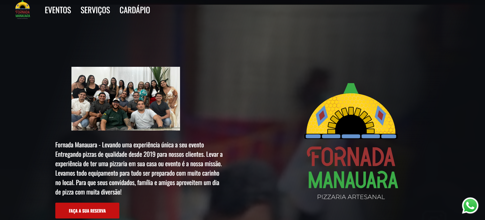

# Fornada Manauara 🍕🔥

Bem-vindo ao repositório do **Fornada Manauara**! Este projeto tem como objetivo proporcionar uma experiência única, levando a pizzaria artesanal até o cliente, seja em casa ou em eventos.

## 🚀 Tecnologias Utilizadas

- **HTML**
- **CSS**
- **JavaScript**

## 📌 Funcionalidades

- Exibição de cardápio com pizzas artesanais
- Sistema de reservas para eventos
- Interface responsiva e intuitiva
- Integração com WhatsApp para contato

## 🎨 Layout

O design do projeto foi pensado para transmitir a identidade visual da **Fornada Manauara**, com um visual moderno e atrativo. Inspirado na tradição e no sabor das pizzas artesanais.

## 📷 Imagem do Projeto

## 📬 Contato

Caso tenha dúvidas ou sugestões, entre em contato:
- **E-mail:** alexandrelimacost@gmail.com
- **LinkedIn:** [Meu LinkedIn](https://www.linkedin.com/in/alexandre-lima-costa/)

---

Desenvolvido com ❤️ por **[Alexandre Lima]**.
